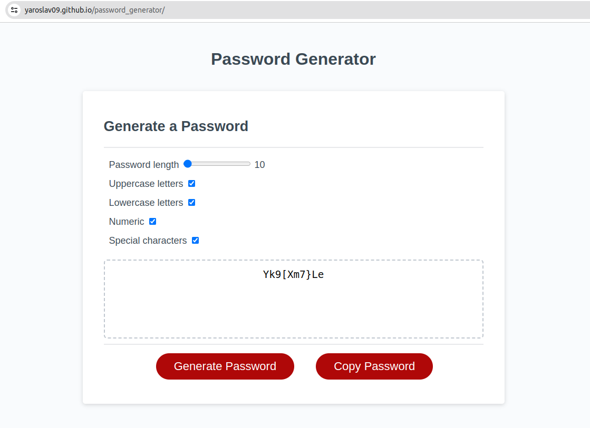

# Password Generator

## Description

### 1. Acceptance Criteria

#### Your application must:

* Generate a password when the button is clicked.

* Present a series of prompts for password criteria:
    - Length of password:
        - At least 8 characters but no more than 128.
    - Character types:
        - Lowercase
        - Uppercase
        - Numeric
        - Special characters ($@%&*, etc.)
    - Code should validate for each input and at least one character type should be selected.
    - Once all prompts are answered, the password should be generated and displayed in an  alert or written to the page.

2. This project was built to explore new features of JavaScript
3. In the process of working on the project, I learned such methods as `.filter`. I also learned how to work with DOM tree in HTML, and DOM elements.
 

## Links

GitHub Repositories: https://github.com/Yaroslav09/password_generator

Deployed Application: https://yaroslav09.github.io/password_generator